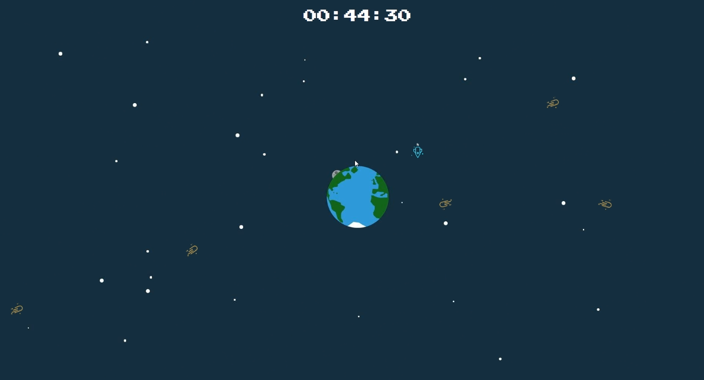
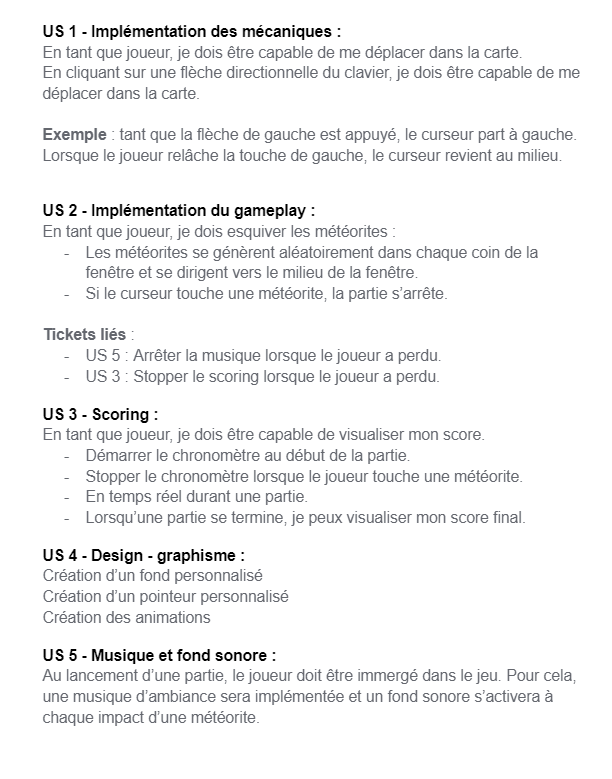

# Watch out 

Ce projet a été fait dans le cadre du séminaire workshop d'éfficom


## l'équipe 


- BOUKHEBZA Allan : Chef d’équipe

- NASSIH Afaf : Suppléant 
- MASSET Corentyn : développeur 
- GUILLOTON Samuel : développeur 
- LEFEBVRE Louis : développeur 
- Vaisseau Paul : développeur 

## impératif

Une version active de Node.js LTS comprenant un gestionnaire de packages npm est requise. Veuillez visiter https://nodejs.org/en/download/ pour le télécharger, s'il n'est pas déjà installé.

## l'histoire  

Bienvenue dans notre jeu de Game Jam où votre objectif est de survivre à une pluie de météorites qui s'abat sur votre vaisseau spatial ! Vous incarnez un pilote courageux qui doit manœuvrer son vaisseau pour éviter les météorites qui tombent du ciel. Votre survie dépend de votre agilité et de votre rapidité pour éviter les collisions avec les obstacles qui se dressent sur votre chemin. Plus vous survolez de temps, plus la difficulté augmente avec l'arrivée de nouveaux obstacles et de plus en plus de météorites à esquiver. Le but ultime est de tenir le plus longtemps possible et de battre le record du meilleur score. Vous êtes prêt à relever le défi ? Alors montez à bord de votre vaisseau spatial et préparez-vous à une expérience immersive et palpitante !


## Getting Started 

- Dans un premier récuprerer le projet Watch out 

- Ouvrer un terminal dans le projet et installer les packages 


  ```
  npm install 
  ```
- Run the application:

  ```
  npm start
  ```

  Il ouvrira automatiquement votre navigateur sur http://localhost:3000/. 


  

  

## méthodes de travail et outils utilisés 

- Dans un premier temps, on a fait un cahier des charges pour définir toute la tache à faire. 





- Dans un second temps, on a fait un trello pour se répartir les tâches 


 

- Pour finir, on a utilisé Github pour réaliser nos tâches respectives et les fissionner pour créer notre jeu. 


